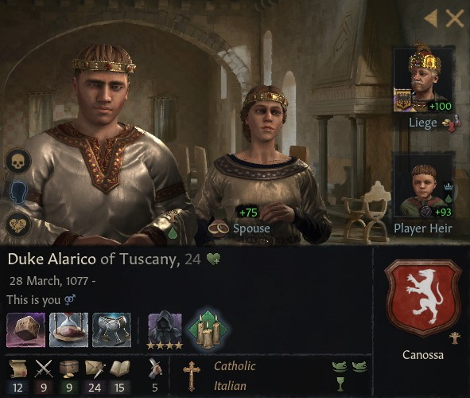

# Duke Alarico of Tuscany

### 1101

## LIFE

28.03.1077-

## HOUSE

Canossa

## DINASTY

Lucca

## TITLES 

- Duchy of Tuscany (inherited 16.01.1099)
- Duchy of Spoleto (inherited 16.01.1099)
- Duchy of Emilia (inherited 16.01.1099)
- County of Modena (inherited 16.01.1099)
- County of Mantua (inherited 16.01.1099)
- County of Firenze (inherited 16.01.1099)
- County of Siena (inherited 16.01.1099)
- Barony of Impruneta

## VASSALS

### 1101

- Count Vitale of Fermo (inherited 01.01.1060 )

- Countess Mariana of Arezzo (inherited 01.01.1060 )

- Count Bonifacio di Brescia (inherited 16.01.1099)

- Count Giacopo of Orvieto (inherited 01.01.1066)

- Count Oberto of Parma (inherited 13.7.1086 - 19.5.1100)

  - Count Oberto of Parma (inherited 19.5.1100)
  - Count Gabrino of Bastia (inherited 19.5.1100)
  - Count Gianfranco of Luni

- Count Ottone of Lucca (inherited 10.9.1091)

- Count Ferdinand of Colmar (inherited 29-12-1091)

- Count Raniero 'the Foolish' of Capua (Granted 13.02.1090)

- Count Fabrizio  of Lanciano (granted 10.4.1097)

  

## PARENTS

- Nuno
- [Duchess Matilda of Tuscany](matilda_bonifacio_canossa_1046.md)

## GRANDPARENTS

- ?
- ?
- Duke Bonifacio IV of Tuscany
- Duchess Beatrix of Lower Lorraine

## SPOUSES

- Princess Raymonde of France

## CHILDREN

- Alarico di Canossa

## OTHER PHOTOS

### 1097

