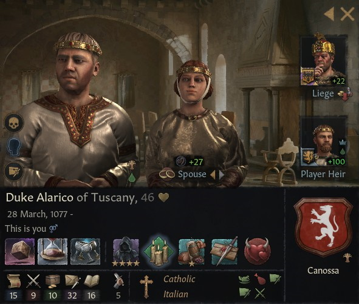
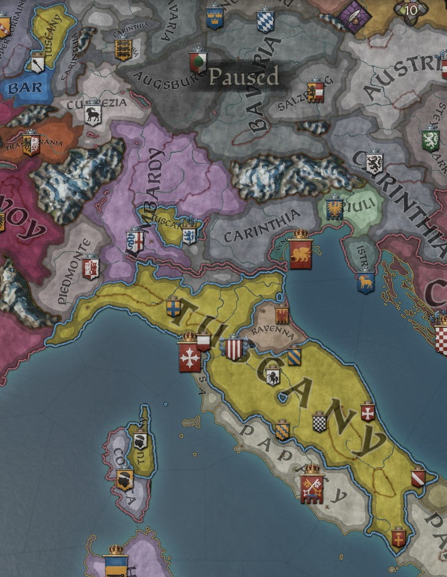

# Duke Alarico of Tuscany

## 1123

## LIFE

28.03.1077-

## HOUSE

Canossa

## DINASTY

Lucca

## TITLES 

- Duchy of Tuscany (inherited 16.01.1099)
- Duchy of Spoleto (inherited 16.01.1099)
- Duchy of Emilia (inherited 16.01.1099)
- County of Modena (inherited 16.01.1099)
- County of Mantua (inherited 16.01.1099)
- County of Firenze (inherited 16.01.1099)
- County of Siena (inherited 16.01.1099)
- Barony of Impruneta

## VASSALS

### 1101-1123

- Count Vitale of Fermo (inherited 01.01.1060 )

  - Count Ordelaffo of Fermo (inherited 10.2.1121)

- Countess Mariana of Arezzo (inherited 01.01.1060 )

  - Count Berto of Arezzo (inherited 21.11.1120)
  - Count Andrea of Spoleto (inherited 21.11.1120)
  - Count Bruno of Orvieto (inherited 21.11.1120)

- [Count Bonifacio of Brescia](bonifacio_matilda_canossa_1084.md) (inherited 16.01.1099)

- *Count Giacopo of Orvieto (inherited 01.01.1066)*

  - *Bobone Orsini (inherited 09.07.1102 - conquered by Mariana of Arezzo 18.01.1119 )*

- Count Oberto of Parma (inherited 13.7.1086 - 19.5.1100)

  - Count Oberto of Parma (inherited 19.5.1100)
  - Count Gabrino of Bastia (inherited 19.5.1100)
  - *Count Gianfranco of Luni (inherited 19.5.1100 - conquered by Gabrino of Bastia 19.04.1106)*

- Count Ottone of Lucca (inherited 10.9.1091)

- Count Ferdinand of Colmar (inherited 29.12.1091)

- Count Raniero 'the Foolish' of Capua (Granted 13.02.1090)

  - Count Nolfo of Capua (Inherited 24.06.1109)

- [Count Fabrizio of Lanciano](fabrizio_matilda_canossa_1086.md) (granted 10.4.1097)

  

## PARENTS

- Nuno
- [Duchess Matilda of Tuscany](matilda_bonifacio_canossa_1046.md)

## GRANDPARENTS

- ?
- ?
- Duke Bonifacio IV of Tuscany
- Duchess Beatrix of Lower Lorraine

## SPOUSES

- Raymonde
- Mechthild

## CHILDREN

- Alarico 
- Bermudu 
- Goffredo 
- Raimondo 
- Filippo 
- Filippo 
- Joscella 
- Filomena 
- Ciro

## OTHER PHOTOS

### 1101

## FAMILY TREE

- Alarico
  - Nuno
  - Matilda
    - Bonifacio IV
      - Tedaldo
      - Willa Bosonid 
    - Beatrix
      - Friedrich II
      - Mathilda Konradiner

## MAPS

## 1123

