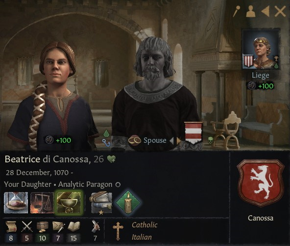

# Beatrice 

### 1097

## LIFE

28.12.1070

## HOUSE

Canossa

## DINASTY

Lucca

## TITLES 

## PARENTS

- Nuno
- [Duchess Matilda of Tuscany](matilda_bonifacio_canossa_1046.md)

## GRANDPARENTS

- ?
- ?
- Duke Bonifacio IV of Tuscany
- Duchess Beatrix of Lower Lorraine

## SPOUSES

- Vladislav
- Otakar Premyslid (matrilineal)

## CHILDREN

- Raimondo
- Sesto

## FAMILY TREE

- Beatrice
  - Nuno
  - Matilda
    - Bonifacio IV
      - Tedaldo
      - Willa Bosonid 
    - Beatrix
      - Friedrich II
      - Mathilda Konradiner

