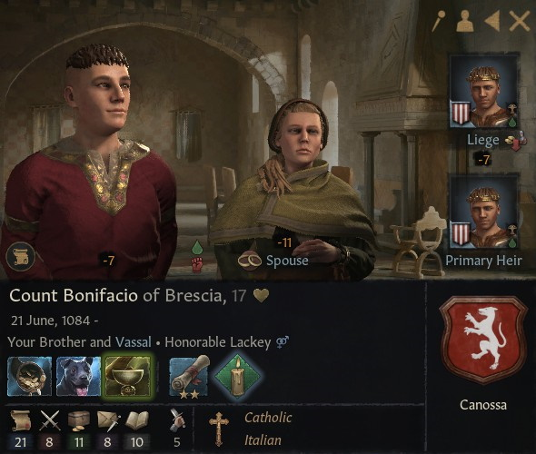

# Count Bonifacio of Brescia

### 1101

## LIFE

21.06.1084			

## HOUSE

Canossa

## DINASTY

Lucca

## TITLES 

- County of Brescia (inherited 16.01.1999)
- County of Ferrara (inherited 16.01.1999)

## PARENTS

- Nuno
- [Duchess Matilda of Tuscany](matilda_bonifacio_canossa_1046.md)

## GRANDPARENTS

- ?
- ?
- Duke Bonifacio IV of Tuscany
- Duchess Beatrix of Lower Lorraine

## SPOUSES

- Countess Asta Palsdatter of Brescia

## CHILDREN

### 

