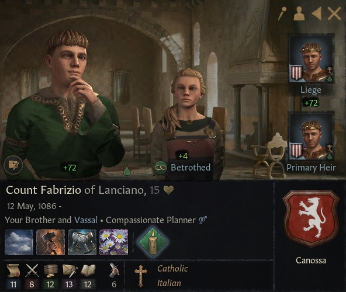

# Count Fabrizio of Lanciano

### 1101

## LIFE

12.05.1086			

## HOUSE

Canossa

## DINASTY

Lucca

## TITLES 

- County of Lanciano (inherited 10.04.1097)

## PARENTS

- Nuno
- [Duchess Matilda of Tuscany](matilda_bonifacio_canossa_1046.md)

## GRANDPARENTS

- ?
- ?
- Duke Bonifacio IV of Tuscany
- Duchess Beatrix of Lower Lorraine

## SPOUSES

- Alfridr Palsdatter af Orkneyjar

## CHILDREN

### 

