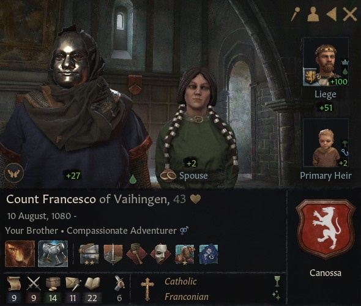
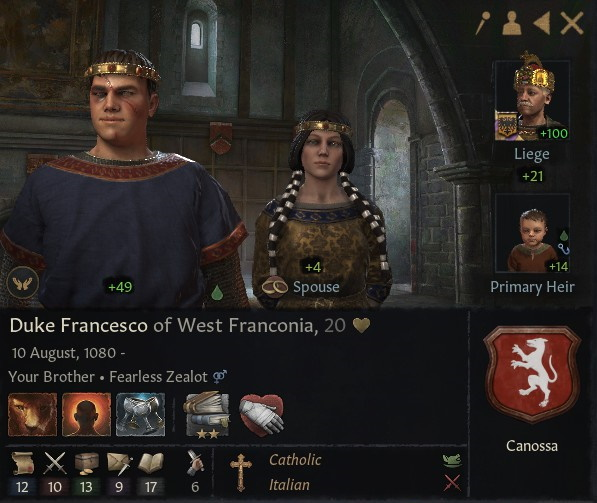

# Count Francesco of Vaihingen

### 1123

## 

## LIFE

10.08.1080			

## HOUSE

Canossa

## DINASTY

Lucca

## TITLES 

- Duchy of West Franconia (inherited 16.01.1999 - conquered by claimant 30.12.1101)
- County of Vaihingen (granted 16.12.1096)
- County of Speyer (granted 16.12.1096)

## VASSALS

### 1101

- Count Otto Godschalkszoon of Dürn (Conquered by claimant 01.04.1072-)
- Count Siegfried of Worms (inherited 01.01.1066)
  - Count Stephan of Worms (inherited 04.05.1099)
- Count Sighard of Kaiserslautern (inherited 26.09.1091)

## PARENTS

- Nuno
- [Duchess Matilda of Tuscany](matilda_bonifacio_canossa_1046.md)

## GRANDPARENTS

- ?
- ?
- Duke Bonifacio IV of Tuscany
- Duchess Beatrix of Lower Lorraine

## SPOUSES

- Berta

## CHILDREN

- Alvise

### OTHER PHOTOS

## FAMILY TREE

- Giorgio
  - Nuno
  - Matilda
    - Bonifacio IV
      - Tedaldo
      - Willa Bosonid 
    - Beatrix
      - Friedrich II
      - Mathilda Konradiner