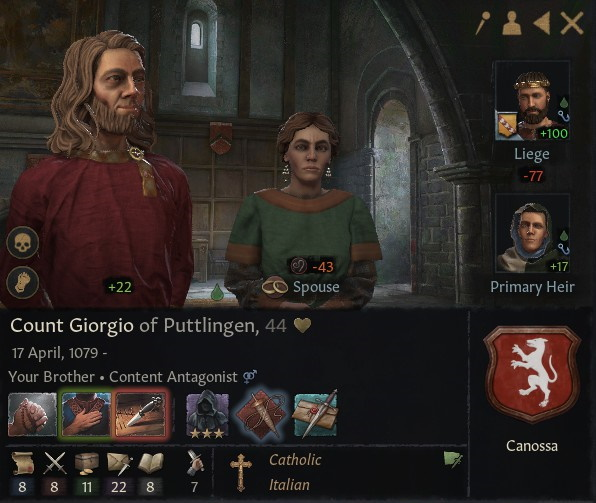
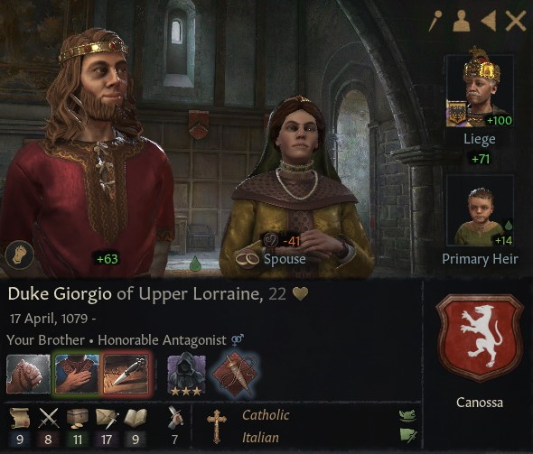

# Count Giorgio of Puttlingen

### 1123

## LIFE

17.04.1079-

## HOUSE

Canossa

## DINASTY

Lucca

## TITLES 

- Duchy of Upper Lorraine (inherited 16.01.1999 - conquered by claimant 14.10.1108)
- County of Puttlingen (granted 16.12.1096)
- County of Metz (granted 16.12.1096 - revoked 07.07.1115)

## VASSALS

### 1101

- Count Dietrich of Nancy (inherited 9.8.1081)
- Count Karlmann of Saarbrücken (inherited 26.09.1091 )

### 1108

None

## PARENTS

- Nuno
- [Duchess Matilda of Tuscany](matilda_bonifacio_canossa_1046.md)

## GRANDPARENTS

- ?
- ?
- Duke Bonifacio IV of Tuscany
- Duchess Beatrix of Lower Lorraine

## SPOUSES

- Stephania

## CHILDREN

- Francesco
- Matilda
- Lidia
- Giorgio
- Clotilde

## OTHER PHOTOS

### 1101

## FAMILY TREE

- Giorgio
  - Nuno
  - Matilda
    - Bonifacio IV
      - Tedaldo
      - Willa Bosonid 
    - Beatrix
      - Friedrich II
      - Mathilda Konradiner