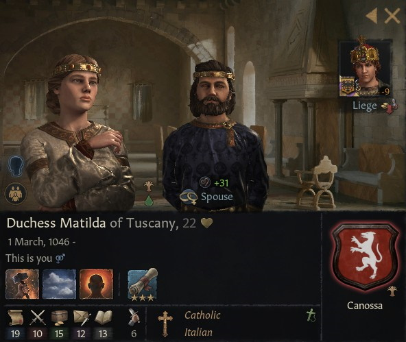
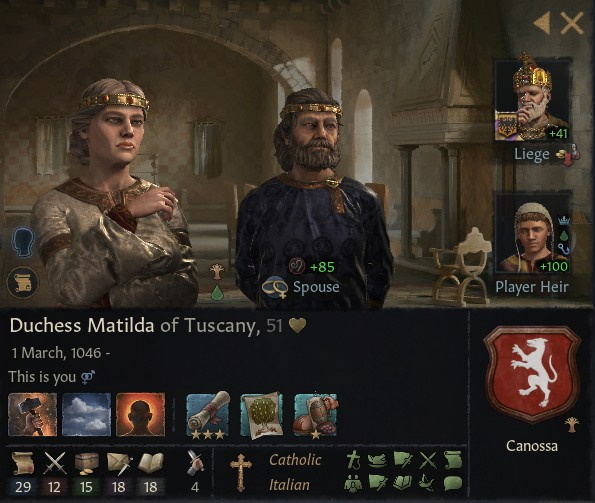

# Duchess Matilda of Tuscany

### 1068

## LIFE

01.03.1046-

## HOUSE

Canossa

## DINASTY

Lucca

## TITLES 

- Duchy of Tuscany (inherited 6.5.1052)
- Duchy of Spoleto (inherited 1.1.1057)
- County of Brescia (inherited 1.7.1055)
- County of Modena (inherited 1.7.1055)
- County of Mantua (inherited 1.7.1055)
- County of Firenze (inherited 1.7.1055)
- County of Siena (inherited 1.7.1055)
- County of Ferrara  (inherited 1.7.1055)
- County of Lanciano (conquered 28.12.1072)
- Duchy of Upper Lorraine (conquered by claimant 18.10.1092)
- Duchy of West Franconia  (conquered by claimant 12.06.1092)
- Duchy of Emilia (created 25.08.1096)

## VASSALS

- Count Vitale of Fermo (1060- )
- Count Arduino of Parma (1052-1078)
  - Count Oberto of Parma (1078-1086)
  - Count Oberto of Parma (1086-)
- Countess Mariana of Arezzo (1060- )
- Count Anselmo of Lucca (1032-1080)
  - Count Mariano of Lucca (1080-1091)
  - Count Ottone of Lucca (1091-)
- Count Giacopo of Orvieto (1066-)
- Count Otto Godschalkszoon of Dürn (1092-)
- Count Siegfried of Worms (1092-)
- Count Dietrich of Nancy (1092-)
- Count Raniero 'the Foolish' of Capua (1090-)
- Count Sighard of Kaiserslautern (1092-)
- Count Ferdinand of Colmar (~1081_1092 ?  )
- Count Karlmann of Saarbrücken ( 1092 )
- Count Francesco of Vaihingen (16.12.1096)
- Count Giorgio of Puttlingen  (16.12.1096)

## PARENTS

- Duke Bonifacio IV of Tuscany
- Duchess Beatrix of Lower Lorraine

## GRANDPARENTS

- Count Tedaldo of Brescia
- Willa Bosonid
- Duke Friedrich II of Upper Lorraine
- Mathilda Konradiner

## SPOUSES

- Duke Nuno of Tuscany

## CHILDREN

- Beatrice di Canossa
- Alarico di Canossa
- Count Giorgio of Puttlingen
- Count Francesco of Vaihingen
- Bonifacio di Canossa
- Fabrizio di Canossa

## OTHER PHOTOS

### 1097

